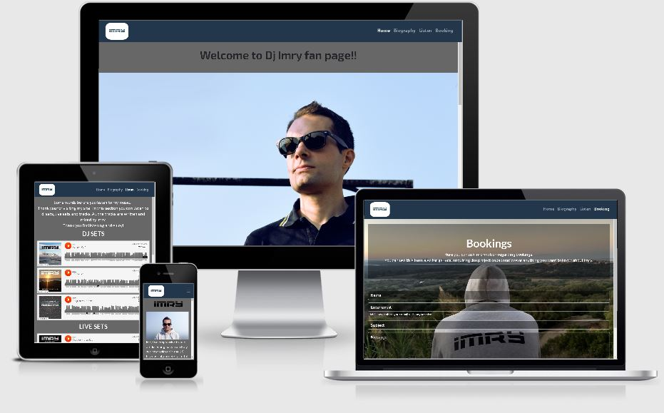
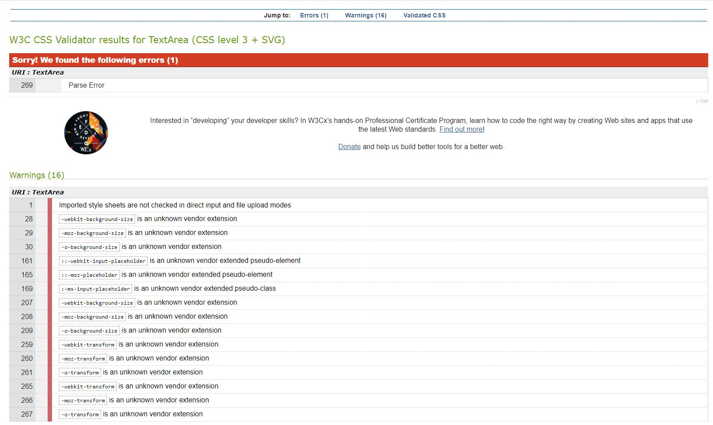

User Centric Frontend Development Project Milestone 1 - Code Institute

For the deployed site follow :

# **_Dj Imry - Trance Dj & Producer_**

This is my first Milestone Project for the [Code Institute](https://codeinstitute.net/) Fullstack Web Developer Diploma. This project is design to demonstrate the skills I have gain from the User Centric Frontend Development module. With this project I want to demostrate my knoledge on using HTML and CSS languages.

## **_Purpose Of The Project_**

This project is design to showcase my own DJ brand with the use of picture and music links that I have made during my music carrier.

The main purpose of this project is to provide the users with infomation related to Dj Imry depending on the user needs.
I want fan to be able to check news, listeners to listen to my music and promoter to check my information and music to be valuated on regards of booking opportunity.

## **_UX_**

The web-site is design with a "Mobile-First" approach.

When reaching the home page you are welcomed with an high quality picture and 4 reviews from fans and professionals. The user friendly layout invite the user to view the biography page, music page and in the end a section for bookings and general enquires.

The web site is designed for three type of users. The listeners , the fans and the promoters. The users have different way to listen to my music and connect with social media.

### **_User Stories_**

* As a Listener, I want to be able to listen to Dj Imry's music by clicking to the "Listen" page, SoundCloud and YouTube Icons on the footer. The listener can come back to the web site to check for new music.

* As a Fan, I want to be able to access Dj Imry's music by clicking to the "Listen" page, SoundCloud and YouTube Icons on the footer, check social media post via social icons on the footer. The fan can come back to the web site to check news via social media icons and new music .

* As a Promoter, I want to check Imry's biography page, reviews from professionals, check social media and listening to Imry's music to consider future bookings. The promoter can come back to the web site to see the progression of my carrier via new reviews, listen to new music and check information on social media.

### **_Colors Scheme_**

The project was develop by keeping colors to a minimum. I took the inspiration by the color scheme used in the video project "Resume Project" Code Institute "User Centric Front End Development Project". 

I have used the following color throughout the web-site.

Nav bar and footer have background color (#23374c) which mark nicely the start and end of the page. 

The Navbar has the color (#676767) for the pages names when not active. When the page are view so they are active they become color (#fafafa) which contrast with the dark background color of the Navbar.

The Footer has the social media icons color (#fafafa) which contrast with the dark color of the background.

On the home page the background color for the Wecome text and testimonial part is color (#676767). 

Color (#676767) has been used in the Biography page as a background color. Where at the top I have used a black "Imry logo" and the writing describing the Biography is color (#fafafa) which give a nice contrast for an easy reading specially in small devices.

The color (#676767) has also been used for the background color of the Listen page . Here as well to keep the color scheme consistant I have used the color (#fafafa) for the section titles and for wording at the top of the page.

On the booking page the colors used are only for the button (#676767) and for the wording the color (#fafafa).

### **_Wireframe_**

Link to Wireframes folder (media/wireframes)

For the Wireframes I have decided to design it by hand. There has been no alteration to Wireframes from the start of the project.

## **_Features_**

### **_Existing Features_**

The web site has been developed to make the user able to navigate any page with ease.
The Fonts used are taken from [Google Font](https://fonts.google.com/). The fonts are used consistantly throughout the site. The font used for the titles is "Lato" and for paragraphs the font used is "Exo 2".  

#### **_Navbar_**

The Navbar has the "Imry logo" on the top left that if clicked will take the user to the Home page in both mobile and desktop view. On mobile view the navbar collect under a burger menu icon collecting all four pages.

#### **_Home Page_**

The home page has a picture of Imry with a Imry logo on the top center and an industrial background picture. Below the hero image you can read reviews of Imry. The Home page describe to the user Imry qualities.

#### **_Biography Page_**

The Biography page has four pictures of Imry and on the side paragraphs describing to the User Imry carrier.

#### **_Listen Page_**

The listen page consist of three sections. All the sections have music players taken from [Soundcloud](https://soundcloud.com/). On each section the user can listen to : Dj sets, Live sets and single tracks.

#### **_Booking Page_**

The Booking page has a background image of Imry and has a Jumbotron semi-transparent with the description of can be done on the page. The user in this page can fill in a form for bookings and general enquires.

### **_Additional Features To Implement_**

* In the future I would like to add a shop page where the users can buy Imry gadgets.

* In the future I would like to add a mailing list to keep the users informed on Imry new realese and gigs.

* In the future I would like to add a page with a calendar for Imry gigs.

## **_Technologies Used_**

1. [HTML](https://en.wikipedia.org/wiki/HTML) has been used in this project becase is the standard markup language for documents designed to be displayed in a web browser.

2. [CSS](https://en.wikipedia.org/wiki/CSS)
CSS is a style sheet language. It is used to style markup language such as HTML.

3. [GITPOD](https://gitpod.io/) has been used as an on-line IDE followed by [GITHUB](https://github.com/) for deployment. IDE is a software application used by computer programmers for software development.

4. [FONTAWESOME](https://fontawesome.com/) has been used to implement social icons. Fontawasome is use to add icons to web pages.

5. [GOOGLEFONTS](https://fonts.google.com/) has been used to style the fonts of the writing on the web site. 

6.  [BOOTSTRAP4](https://getbootstrap.com/) has been used to achive mobile first design and to achive a structured layout.

7. [jQuery](https://jquery.com/) Bootstrap 4 to achive certain effects need to refer to [JavaScript](https://www.javascript.com/) technology. By using the jQuery framework I have been able to add a Modal in the Booking page and drop down menu for the Navbar when the website is viewed on a mobile device.

8. [JavaScript](https://www.javascript.com/) has been used to be able to display correctly the modal on the booking page.

## **_Testing_**

Html and CSS pages has been run through [WC3](https://validator.w3.org/) and [CSSValidatorService](https://jigsaw.w3.org/css-validator/).

JavaScript file has been tested with [Jshint](https://jshint.com/)

No errors has been detected on HTML pages.

No errors has been detected on CSS page.

No errors has been detected on JavaScript page.

On CSS page a series of warning are present due to browers prefixes in the media query 
I have decided to keep the prefix even if warnings have been revealed because I want to make sure that a cross-browser compatibility is achived.

1. ### **_Navigation links_**

* The links present in the Navbar area are all responding correctly in all pages.

* The links in the Footer are all responding correctly in all pages.

2. ### **_Responsive design_**

* The website has been developed with mobile first design. The users can view effectively the web site in mobile and tablet as in desktop. With the use of [BOOTSTRAP4](https://getbootstrap.com/) features on mobile view the Navbar will change in a drop down menu. Pictures and texts in all pages will be shown in a vertically pleasent way. The picture and text in the rest of the pages will adjust the sizes accondingly to the different size of the devices without distorting the images.

3. ### **_Users Scenarios_**

* All the three type of User, mentioned in the "User Stories section", can click in any link in the Navbar to access all the other pages. In any pages the user is viewing can click the "Imry Logo" in the Navbar and will be ridirected in the home page. In any pages the User is visiting can click in the social icons in the Footer and a new page will open with the social media web site without loosing the page is viewing. All links in the listening page are playing the music from [SoundCloud](https://soundcloud.com/) as intended.

4. ### **_Contact Form_**

 When the User open the Booking page will find a form to fill in.

 * If the User does not enter a text is Name section of the form an error "Please fill in this field" will show.

 * If the User does not enter a valid Email address in the email address section of the form an error "Please include an "@" in the email address" will show.

* If the User does not enter a text in the Subject section of the form an error "Please fill in this field" will show.

* If the User does not enter a text in the Message section of the form an error "Please fill in this field" will show.

If the User fill all section's form as required a modal message will appear at the top of the screen stating "Thank you for your message! We will reply with the information you have required as soon as possible."

The website has been tested on the folloowing devices:
* Iphone 7
* Motorola G8 power 
* Motorola G5
* I pad 2

The website has been tested on the following browsers:

* Chrome
* Microsfot Edge
* Opera
* Firefox

## **_Debugging_**

Durign the creation of the Booking page I had a problem with the ability to show the error message when the form wasn't completed correctly. The modal message would show even if the form wasn't completed in all its parts.
The problem was fixed by adding a JS page with the help of tutoring team.

## **_Deployment_**

### **_Remote Deployment_**

The website is developed with Gitpod IDE. With the [Code Institute](https://codeinstitute.net/) template I started a new repository. After completing the website the page was deployed remotly following this steps:

1. Log in to [Github](https://github.com/)
2. Go to mattyImry/MS1-DJ-Imry-Trance-Dj-Producer
3. Under the repository name open Settings tab
4. Scroll down to find GitHub pages
5. In GitHub pages tab click on None to select the branch to publish
6. In the drop down menu select the folder you want to publish
7.  Click Save

### **_Local Deployment_**

To clone the repository for collaboration to GitHub Desktop following this steps:

1. Log in to [Github](https://github.com/)
2. Go to mattyImry/MS1-DJ-Imry-Trance-Dj-Producer
3. Under the repository click Code
4. Click Open with GitHub Desktop to clone
5. Open the repository with GitHub Desktop
6. Follow the promps to complete the cloning and log in to your GitHub account

To clone the repository for collaboration  using the command line following this steps:

1. Log in to [Github](https://github.com/)
2. Go to mattyImry/MS1-DJ-Imry-Trance-Dj-Producer
3. Under the repository click Code
4. To clone the repository using HTTPS, click clipboard icon under "Clone with HTTPS"
5. To clone the repository using an SSH key with the Organisation cetificate  click clipboard icon under SSH tab
6. To clone a repository using GitHub CLI, click clipboard icon under GitHub CLI tab
7. Open Git Bash 
8. Change working directory to the location where you want the cloned directory
9. Type in terminal type $ "git clone" ,paste URL from steps before
10. Press enter to create clone

## **_Credit_**

### **_Media_**

* The pictures used in the website are property of the Developer. 

* The tracks and live set shown in the Listen page are property of the Developer. Dj set have been mixed by the Developer the tracks in the Djset were purchased and all the reproduction right are granted by the artists.

### **_Codes_**

* The CSS code for changing the Placeholder text color for the form in the Booking page was taken from [Stackoverflow](https://stackoverflow.com/) 

*  The CSS code for placing the background photo in full width and heith in the Booking page was taken from [Stackoverflow](https://stackoverflow.com/) 

* The JS code was created with the help of Haley and Johann from tutor support

### **_Acknowledgements_**

* I would like to specially thank the support from my mentor , the Slack community and the team of tutors always very helpfull to explain problems and to explain new solution.